# Агент-помощник учёного на основе RAG+LLM

Учебный репозиторий для спецсеминара. Автор: Иван Селиванов.

Проект показывает моего помощника учёного: он работает с выбранными источниками, отвечает на вопросы только на основе подключённых материалов и помогает превращать корпус документов в понятные научные ответы.

## Что такое RAG+LLM в этом проекте

RAG+LLM здесь означает связку из двух частей:

- база знаний из источников, фрагментов и метаданных;
- языковая модель, которая получает найденные фрагменты и формирует ответ на русском языке.

Главная идея: модель не должна отвечать "из головы". Она должна опираться на найденные источники, показывать, откуда взят ответ, и честно писать, если данных не хватает.

## Скриншот

Ниже показан правильный интерфейс помощника: слева выбран источник, в центре ответ на вопрос, справа область заметок.

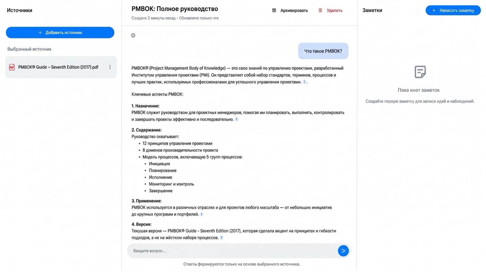

## Демонстрация по рисункам курсовой

В демонстрацию добавлены все 10 рисунков из курсовой работы. Они лежат в [docs/figures](docs/figures), а полная русскоязычная галерея с пояснениями находится в [docs/demo.md](docs/demo.md).

### 1. Общая схема RAG

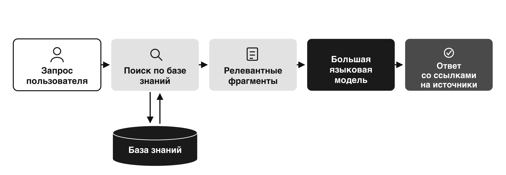

### 2. Конвейер обработки источников

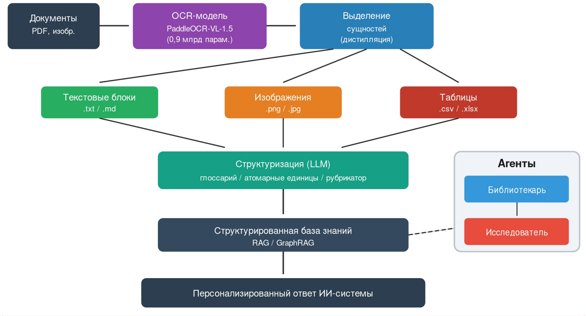

### 3. Интерфейс помощника

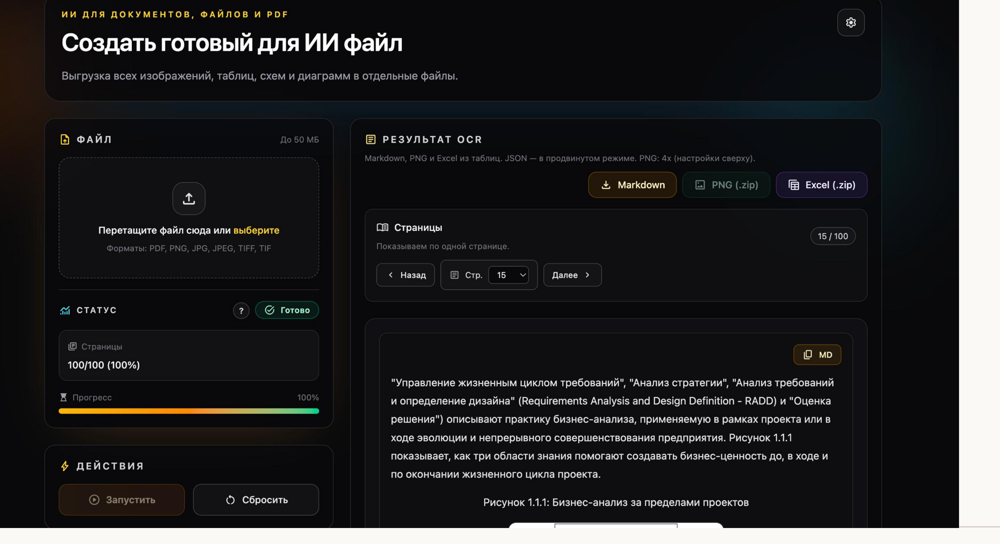

### 4. Подготовка данных

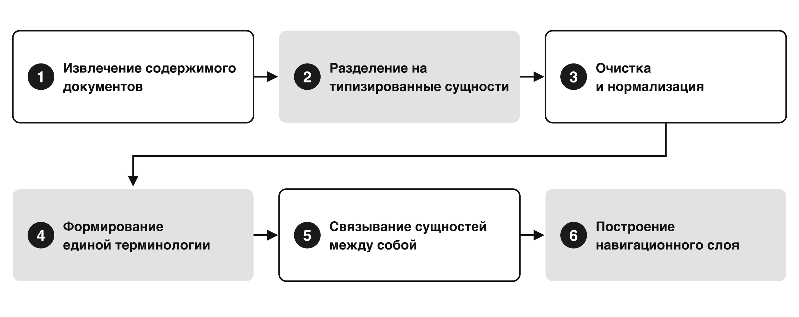

### 5. База знаний

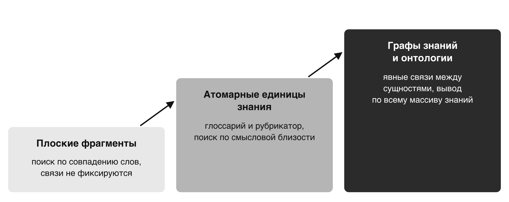

### 6. Результат ответа

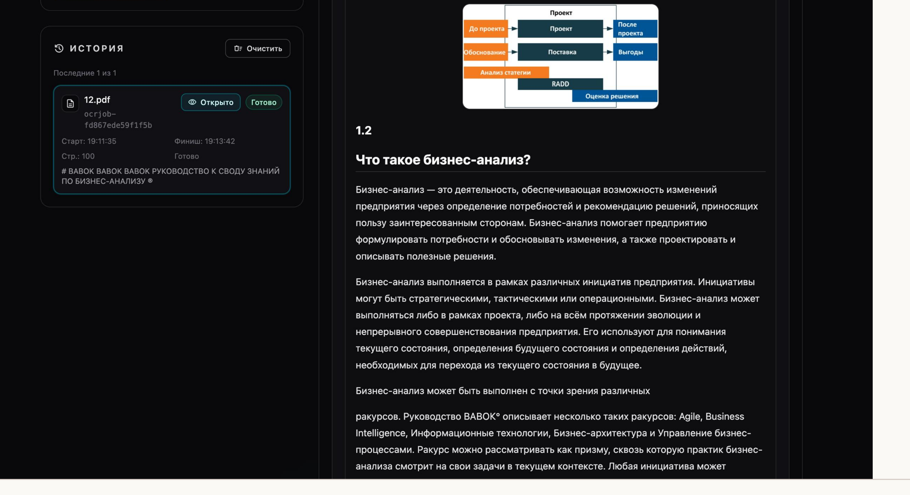

### 7. Демонстрация RAG-сценария

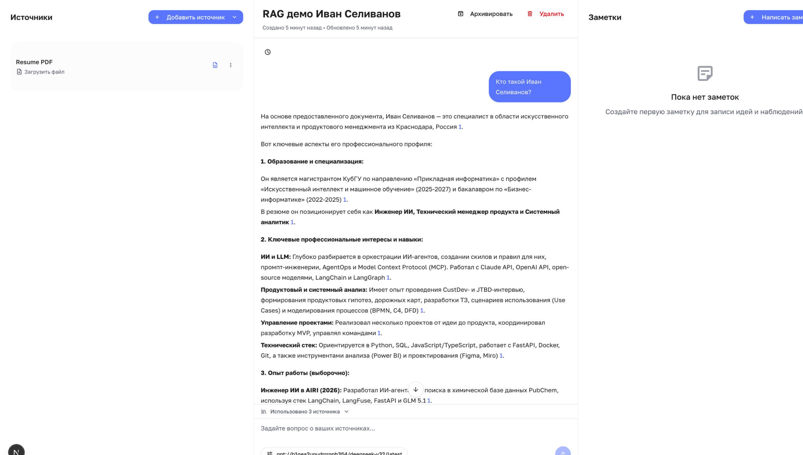

### 8. Чёрно-белая схема конвейера

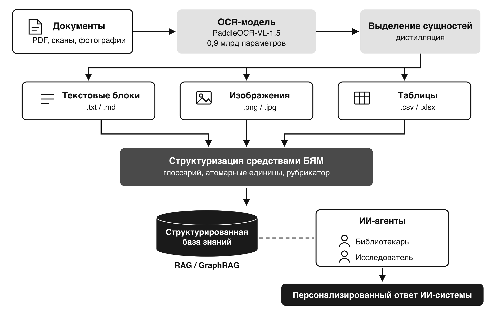

### 9. Структуризация материалов

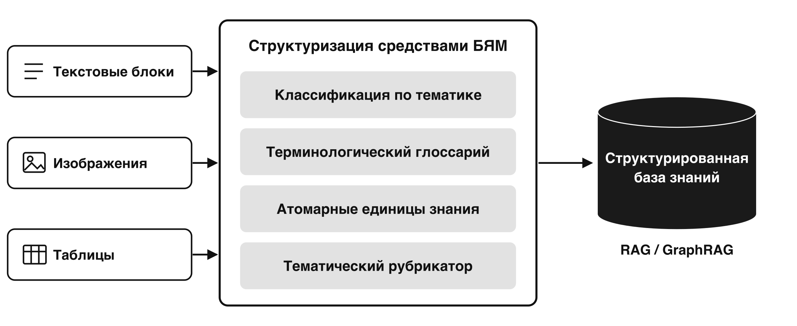

### 10. Агентная организация

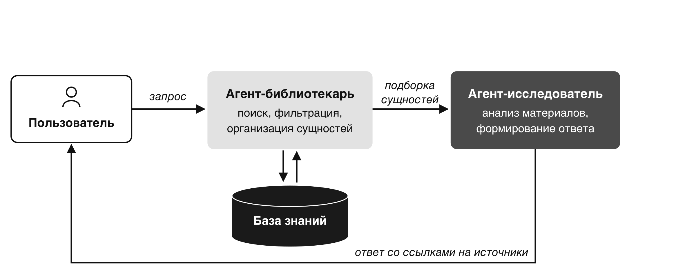

## Связь с курсовой работой

Курсовая работа приложена в репозитории как подтверждающий учебный материал:

[Курсовая работа Ивана Селиванова](docs/coursework/coursework-selivanov.pdf)

Тема проекта связана с применением RAG-подхода для научной работы: загрузка источников, поиск по корпусу, ответы с опорой на документы и подготовка заметок.

## Возможности агента

- добавляет источник в базу знаний;
- разбивает текст на смысловые фрагменты;
- ищет релевантные фрагменты по вопросу;
- формирует ответ на русском языке;
- показывает, какие источники использованы;
- помогает вести заметки по прочитанному материалу.

## Архитектура

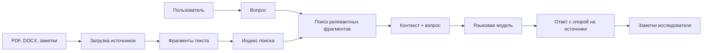

## Минимальный демонстрационный запуск

В репозитории есть небольшой демонстрационный модуль без внешних зависимостей. Он показывает принцип поиска по локальным фрагментам.

```bash
PYTHONPATH=src python3 -m scientist_rag_assistant.demo "Что делает помощник учёного?"
```

Чтобы вывести список всех рисунков, используемых в демонстрации:

```bash
PYTHONPATH=src python3 -m scientist_rag_assistant.demo --figures
```

Для полноценной версии вместо простого поиска подключается векторная база и языковая модель.

## Промпт помощника

Основная инструкция лежит в [prompts/scientist-prompt.md](prompts/scientist-prompt.md).

Ключевое правило:

> Отвечай только на основе найденных фрагментов. Если в источниках нет ответа, прямо скажи, что данных недостаточно.

## Ограничения

- В публичный репозиторий не добавляются чужие полные PDF-корпуса без проверки прав.
- Реальные ключи API не хранятся в репозитории.
- Если источник не содержит ответа, агент не должен заполнять пробел догадкой.

## Проверка перед сдачей

```bash
test -f docs/screenshots/rag-assistant-interface.jpg
test -f docs/coursework/coursework-selivanov.pdf
test -f docs/demo.md
python3 - <<'PY'
from pathlib import Path

figures = [
    "рисунок-1-rag.png",
    "рисунок-1-конвейер.png",
    "рисунок-2-интерфейс.png",
    "рисунок-2-подготовка.png",
    "рисунок-3-знания.png",
    "рисунок-3-результат.png",
    "рисунок-4-rag-демо.png",
    "рисунок-4-конвейер-чб.png",
    "рисунок-5-структуризация.png",
    "рисунок-6-агенты.png",
]

readme = Path("README.md").read_text(encoding="utf-8")
demo = Path("docs/demo.md").read_text(encoding="utf-8")
for name in figures:
    assert Path("docs/figures", name).is_file(), name
    assert f"docs/figures/{name}" in readme, name
    assert name in demo, name

assert len(list(Path("docs/figures").glob("*.png"))) == len(figures)
PY
PYTHONPATH=src python3 -m scientist_rag_assistant.demo --figures
python3 -m compileall -q src
```

## Результат

Репозиторий оформлен как отчёт по моему RAG+LLM помощнику учёного: есть описание, архитектура, правильный скриншот, курсовая работа, все рисунки из демонстрации, промпт и минимальная демонстрация принципа поиска по источникам.
