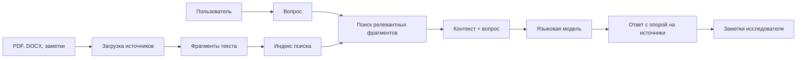

# Агент-помощник учёного на основе RAG+LLM

Учебный репозиторий для спецсеминара. Автор: Иван Селиванов.

Проект показывает моего помощника учёного: он работает с выбранными источниками, отвечает на вопросы только на основе подключённых материалов и помогает превращать корпус документов в понятные научные ответы.

## Что такое RAG+LLM в этом проекте

RAG+LLM здесь означает связку из двух частей:

- база знаний из источников, фрагментов и метаданных;
- языковая модель, которая получает найденные фрагменты и формирует ответ на русском языке.

Главная идея: модель не должна отвечать "из головы". Она должна опираться на найденные источники, показывать, откуда взят ответ, и честно писать, если данных не хватает.

## Скриншот

Ниже показан правильный интерфейс помощника: слева выбран источник, в центре ответ на вопрос, справа область заметок.


## Связь с курсовой работой

Курсовая работа приложена в репозитории как подтверждающий учебный материал:

[Курсовая работа Ивана Селиванова](docs/coursework/coursework-selivanov.pdf)

Тема проекта связана с применением RAG-подхода для научной работы: загрузка источников, поиск по корпусу, ответы с опорой на документы и подготовка заметок.

## Возможности агента

- добавляет источник в базу знаний;
- разбивает текст на смысловые фрагменты;
- ищет релевантные фрагменты по вопросу;
- формирует ответ на русском языке;
- показывает, какие источники использованы;
- помогает вести заметки по прочитанному материалу.

## Архитектура



## Минимальный демонстрационный запуск

В репозитории есть небольшой демонстрационный модуль без внешних зависимостей. Он показывает принцип поиска по локальным фрагментам.

```bash
python -m scientist_rag_assistant.demo "Что делает помощник учёного?"
```

Для полноценной версии вместо простого поиска подключается векторная база и языковая модель.

## Промпт помощника

Основная инструкция лежит в [prompts/scientist-prompt.md](prompts/scientist-prompt.md).

Ключевое правило:

> Отвечай только на основе найденных фрагментов. Если в источниках нет ответа, прямо скажи, что данных недостаточно.

## Ограничения

- В публичный репозиторий не добавляются чужие полные PDF-корпуса без проверки прав.
- Реальные ключи API не хранятся в репозитории.
- Если источник не содержит ответа, агент не должен заполнять пробел догадкой.

## Проверка перед сдачей

```bash
test -f docs/screenshots/rag-assistant-interface.jpg
test -f docs/coursework/coursework-selivanov.pdf
```

## Результат

Репозиторий оформлен как отчёт по моему RAG+LLM помощнику учёного: есть описание, архитектура, правильный скриншот, курсовая работа, промпт и минимальная демонстрация принципа поиска по источникам.
